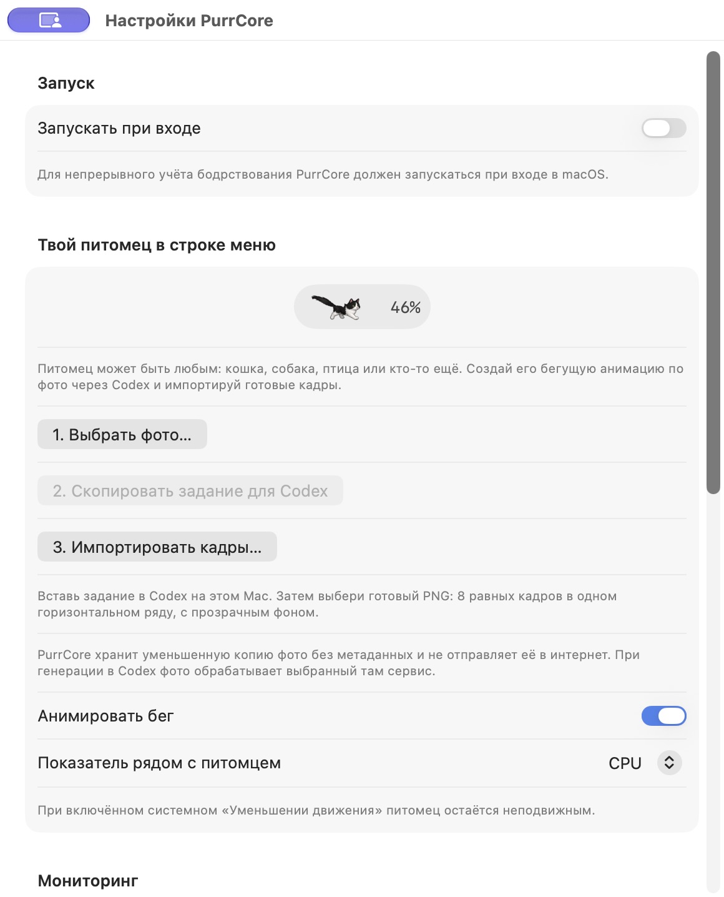

# PurrCore

Русский · [English](README.md)

PurrCore помогает одним взглядом заметить нагрузку на Mac: питомец в строке меню бежит быстрее, когда процессор занят.
Открой монитор, чтобы понять, какие приложения и системные процессы создают нагрузку, и посмотреть, как она менялась.
Понятные объяснения процессов и компактная локальная история на семь дней — основа проекта; старые записи ресурсов удаляются автоматически.
Питомец может быть любым: кошка, собака, птица или другое животное.



## Что умеет

- Меняет скорость бега по загрузке CPU. Рядом можно показывать CPU, память, сеть, диск или нагрев.
- Объясняет известные процессы macOS понятным языком: `WindowServer` — отрисовка окон и экранов, `kernel_task` — драйверы, питание и температура, процессы Spotlight — поиск и индексирование файлов.
- Объединяет вспомогательные процессы под названием приложения, чтобы было проще понять, что нагружает Mac.
- Показывает текущее давление памяти и swap, а также историю CPU, памяти, сети и диска за 1 час, 24 часа или 7 дней.
- Считает наблюдаемое время бодрствования, исключая сон и пропуски без работающего PurrCore.
- Учитывает разряды батареи и оценивает бодрствование от полного заряда после достаточного числа наблюдений.
- Читает доступные показатели здоровья SSD. Недоступные значения остаются **неизвестными**, в том числе у внешних дисков.

SwiftUI + AppKit, нативные системные API и SQLite. Отдельный демон и сторонние пакеты для работы не нужны.
Интерфейс выбирает русский или английский по языку системы. Оба README описывают одинаковые возможности.

## Сборка и запуск

Нужны macOS 14+ и Swift 6. Проверено на Mac с Apple Silicon; работа на Intel ещё не проверена.

```bash
swift test
bash script/build_and_run.sh build
open dist/PurrCore.app
```

Сборка создаёт `dist/PurrCore.app` и `dist/purrcorectl` с локальной ad-hoc подписью.
Это не нотарифицированный релиз. Для устойчивого автозапуска перенеси приложение в `/Applications`
и включи запуск при входе в настройках.

## Свой бегущий питомец

1. Открой настройки PurrCore и выбери фото **любого питомца**.
2. Скопируй готовое задание и вставь его в Codex на этом же Mac. Задание указывает локальную копию фото.
3. Попроси Codex создать восемь фаз бега. Генерация зависит от доступного в Codex инструмента изображений.
4. Импортируй полученный PNG в настройках. Новый питомец бежит в темпе нагрузки и сохраняется после перезапуска.

Формат: **8 равных ячеек в одном горизонтальном ряду PNG**.
Рекомендуемый размер — 3072×384 пикселя, фон прозрачный.
Питомец должен целиком помещаться в каждом кадре, с одинаковым масштабом и линией лап.
PurrCore убирает общие прозрачные поля, сохраняя масштаб и положение всех поз.
Размер файла — до 20 МБ. Неровно подготовленные кадры могут дёргаться; PurrCore не проверяет анатомию животного.
Можно заменить фото или анимацию, удалить фото-референс и вернуть встроенную кошку.

PurrCore сам не генерирует изображения и не отправляет фото в интернет.
Он сохраняет копию до 1024 пикселей без исходных метаданных.
При генерации через Codex эту копию обрабатывает выбранный там сервис изображений.
Удаление фото-референса сохраняет уже импортированную анимацию.

## Локальные данные

Данные лежат в `~/Library/Application Support/PurrCore/`.
У каждого Mac своя база и свой питомец. Телеметрии и синхронизации нет.
История ресурсов, завершённые интервалы бодрствования и отметки задач хранятся семь дней.
По умолчанию сессии батареи хранятся бессрочно. В настройках можно выбрать 30, 90 или 365 дней для завершённых разрядов. Удаление старых записей требует подтверждения. Активный разряд сохраняется. Данные питомца можно удалить в приложении.

База содержит агрегаты ресурсов, названия групп процессов и необязательные идентификаторы и подписи задач.
Командные строки, заголовки окон, содержимое документов и задач не записываются.
Не публикуй рабочую базу и личные фото-референсы.

Показатели SSD зависят от macOS и контроллера диска.
Скорость соединения и свободное место не подтверждают физическое здоровье.
PurrCore не запускает самотестирование и ремонт диска.

## Необязательная командная строка

```bash
./dist/purrcorectl live
./dist/purrcorectl run --source example --task-id demo --label "Пример задачи" -- your-command
```

`live` печатает срез нагрузки в JSON. `run` ставит отметки начала и конца и печатает сводку ресурсов.
Этот интерфейс подходит для исполнителей задач, например MemPalace. Он не является зависимостью приложения.

## Вдохновение и лицензия

[RunCat](https://github.com/Kyome22/menubar_runcat) и
[RunCatNeo](https://github.com/runcat-dev/RunCatNeo) — бег в темпе CPU и анимация через слой.
[StillCore](https://stillcore.app/) — идея компактного монитора ресурсов.
PurrCore добавляет понятные группы процессов, локальную историю, учёт бодрствования, показатели SSD и своего питомца.

Код и встроенные рисунки: [Apache License 2.0](LICENSE). Атрибуция — в [NOTICE](NOTICE).
Рисунок встроенной кошки создан генерацией для PurrCore. Исходные фото в репозиторий не входят.
Права на загруженные пользователем фото и анимации остаются у их правообладателей.
